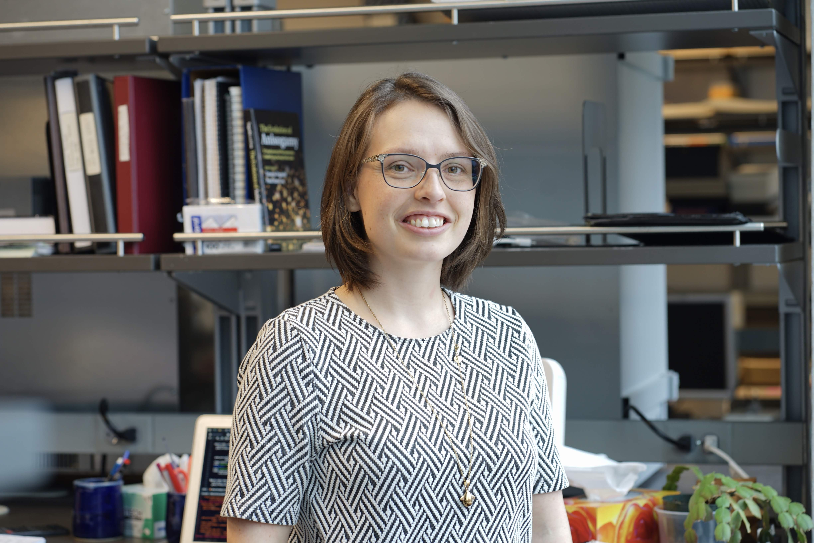

I currently live and work in beautiful Vancouver BC, Canada, in the traditional, unceded, and occupied territory of the xʷməθkʷəy̓əm, Sḵwx̱wú7mesh, and səlilwətaɬ peoples

<strong>My research</strong>

I spent my PhD designing and conducting evolutionary experiments with budding yeast. Mainly, I have tried to show what I know _in theory_ should work. I have tried to select for increased recombination rates between selective markers, select for increased frequency of sex, observe evolutionary rescue, explain fitness differences by protein changes, and assess fitness effects of mutations when they occur in haploid, heterozygous, or homozygous diploid form. In theory yeast is a robust system for genetic manipulation, in reality they are *weak*. Two of my projects failed (as in, I could not answer the question I set out to) due to genetic failure. Another of my projects failed because of machine failure (_in theory_ the incubator should not break down in the middle of the experiment, and the replacement should _in theory_ keep an even temperature). In Swedish there is a fitting expression: "men ja ä int bitter" (literally, "but I'm not bitter").

I'm mesmerized by meiosis. I want to study it (its evolution, its mechanisms, its secrets) preferably in a system other than _Saccharomyces cerevisiae_. Meiosis is inevitably connected to the mating system of an organism (you don't want to meiosis with just anyone), and I'm increasingly fascinated by the way mating systems evolve (in the evolutionary experiment where I forced yeast to go through sexual reproduction much more frequently than they would normally, I found convergent evolution towards haploid cells harboring both mating types 🤯). Evolution of mating system and meiosis are both entangled with genetic architecture and recombination, which are my first and foremost love.

<strong>Videos and photos</strong>
<ul>
 	<li><a href="https://www.youtube.com/watch?v=A3qxCGW4A8w">Dancer, actress and singer in Zoology Huts skit 2017</a></li>
 	<li><a href="https://youtu.be/ax2B198zkmA">Director and visual editor in Zoology Huts skit 2016</a></li>
 	<li><a href="https://www.youtube.com/watch?v=3JJ_hjpWK-0&amp;list=PL8JAfS6VQqkz3ju8IRsvZoQWFOTV42KF-&amp;index=3">Participation in 3 minute thesis semi-final 2016</a></li>
</ul>

<strong>Related pages</strong>
<ul>
 	<li><a href="http://www.biodiversity.ubc.ca">Biodiversity Research Centre, UBC</a></li>
 	<li><a href="http://www.zoology.ubc.ca">Department of Zoology, UBC</a></li>
 	<li><a href="http://stjohns.ubc.ca">St John's College, UBC</a></li>
 	<li><a href="http://beatymuseum.ubc.ca">Beaty Biodiversity Museum, UBC</a></li>
 	<li><a href="http://www.evobio.eu">Erasmus Mundus Master Programme in Evolutionary Biology</a></li>
 	<li><a href="http://EBC uppsala">Evolutionary Biology Centre, Uppsala University</a></li>
 	<li><a href="http://ibg.uu.se/?languageId=1">Biology Education Centre, Uppsala University</a></li>
</ul>

<strong>Name drop</strong>
☀️ My privilege is bigger than the sun ☀️

I'm a proud graduate student of [Dr Sally Otto](https://www.zoology.ubc.ca/~otto/). Being mentored by her is one of my greatest achievements and fortunes. She has taught me humility and compassion.

What I know about experimental design I learned from [Dr Nathaniel Sharp](https://genetics.wisc.edu/staff/sharp-nathaniel/). He has taught me persistence, and persistence.

Discussing science with [Dr Ophélie Ronce](http://www.isem.univ-montp2.fr/en/personnel/teams/metapopulation/ronce-ophelie.index/) always leaves me inspired. She has taught me how to make quantitative genetic models involving stage structure. She inspires me to be generous and genuine.

